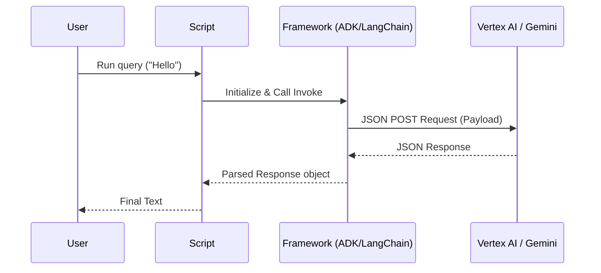
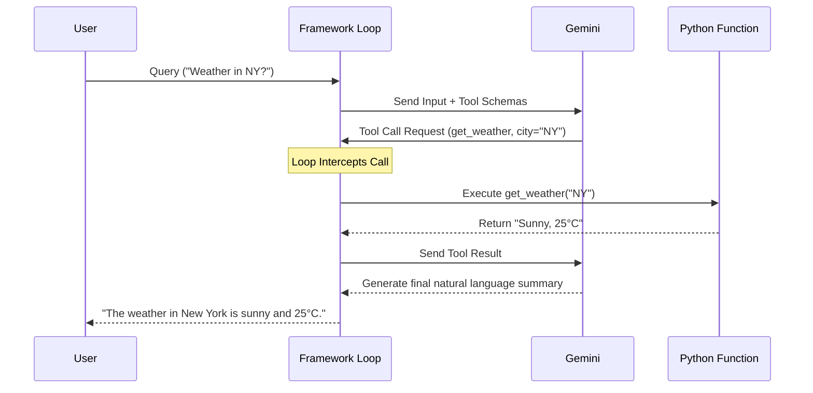
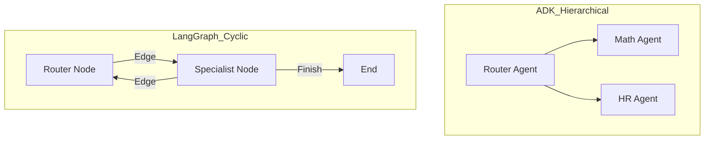
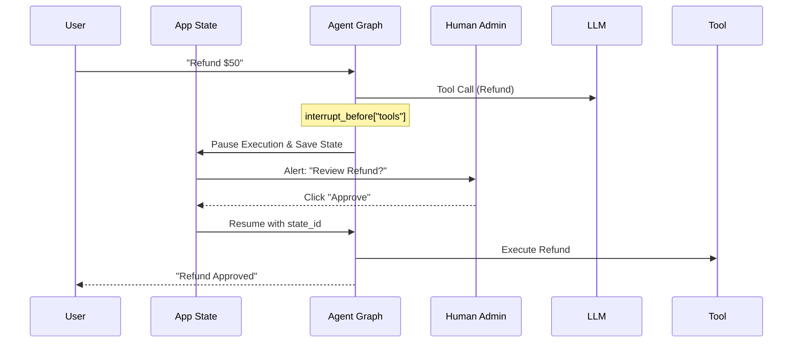

# Agentic AI & LLM Learning Track: Concept Mastery Guide 🧠

This document serves as the master reference guide for all the Core AI Agent concepts we explored. For every feature, it explains the **Concept**, how it is implemented in the **Google ADK (Gen AI SDK)**, and how it is implemented in **LangChain/LangGraph**.

## 🚀 Quick Feature Comparison

| Feature          | Google ADK                          | LangChain / LangGraph                     |
| :--------------- | :---------------------------------- | :---------------------------------------- |
| **Inference**    | Direct `Agent.run()`                | `Runnable` interface / `.invoke()`        |
| **Tool Calling** | Auto-execution via Python list      | Manual binding; requires Executor/Graph   |
| **Multi-Agent**  | Native hierarchical `sub_agents`    | State-based Directed Acyclic Graph (DAG)  |
| **Memory**       | In-memory sessions (stateless REST) | Persistent DB Checkpointers (Thread-safe) |
| **Streaming**    | Message generators                  | Token-level generators & Event streams    |
| **Control Flow** | Callback-based interrupts           | Interrupt nodes & state persistence       |
| **Time Travel**  | Manual payload manipulation         | Native `update_state` & Forking           |

---

---

## 1. Basic Agent Initialization & Inference

### The Concept

At the core of any AI wrapper, the framework must convert your text into a payload the LLM API understands (often referred to as an "invoke" or "generate" call).



### Google ADK

The ADK keeps this extremely simple. It provides a stateful `Agent` class that handles the payload creation.

```python
from google.adk.agents import Agent

agent = Agent(name="my_agent", model="gemini-2.5-flash")
response = agent.run("Hello there!")
print(response.content.parts[0].text)
```

### LangChain

LangChain abstracts the LLM into a generalized `Runnable` interface. You use the `ChatGoogleGenerativeAI` class.

```python
from langchain_google_genai import ChatGoogleGenerativeAI

llm = ChatGoogleGenerativeAI(model="gemini-2.5-flash")
response = llm.invoke("Hello there!")
print(response.content)
```

---

## 2. Prompt Engineering (System Instructions)

### The Concept

Telling the LLM "who" it is and "what" rules it must follow. This is injected as a special `SystemMessage` at the very beginning of the API payload.

### Google ADK

The ADK exposes this via the `instruction` parameter on the Agent object.

```python
agent = Agent(
    name="my_agent",
    model="gemini-2.5-flash",
    instruction="You are a pirate. Always respond in pirate slang."
)
```

### LangChain

LangChain uses explicit `SystemMessage` objects or `ChatPromptTemplate` to construct the payload dynamically.

```python
from langchain_core.prompts import ChatPromptTemplate

prompt = ChatPromptTemplate.from_messages([
    ("system", "You are a pirate. Always respond in pirate slang."),
    ("human", "{user_input}")
])
chain = prompt | llm
chain.invoke({"user_input": "Hello"})
```

---

## 3. Tool Calling (Function Calling)

### The Concept

Giving the LLM the ability to "interact" with the outside world (databases, APIs, math calculations). We provide the LLM a JSON schema of the tool. If the LLM decides it needs the tool, it halts text generation and returns a JSON payload requesting the tool execution. The framework runs the python function and feeds the result back to the LLM.



### Google ADK

You pass a python function array directly to the Agent.

```python
def get_weather(city: str) -> str:
    return f"The weather in {city} is sunny."

agent = Agent(name="weather_bot", model="gemini-2.5-flash", tools=[get_weather])
# The ADK automatically intercepts the function call, runs get_weather,
# and returns the final answer seamlessly.
agent.run("What is the weather in Tokyo?")
```

### LangChain

You use the `@tool` decorator to define schema, and `bind_tools` to attach it to the LLM.

```python
from langchain_core.tools import tool

@tool
def get_weather(city: str) -> str:
    """Returns the weather for a city."""
    return f"The weather in {city} is sunny."

llm_with_tools = llm.bind_tools([get_weather])
# In LangChain, bind_tools does NOT automatically execute the tool.
# You have to use AgentExecutor or LangGraph to actually run the loop.
```

---

## 4. Multi-Agent Systems & Handoffs

### The Concept

Instead of one massive prompt, splitting up responsibilities among specialized agents. An orchestrator agent determines which sub-agent is best suited for the user's query and routes it.


_Figure 1: Specialized agents (Researcher, Coder, Writer) collaborating on a complex task._

### Routing Architectures

| Pattern                       | Logic Flow                             | Complexity                   |
| :---------------------------- | :------------------------------------- | :--------------------------- |
| **Google ADK (Hierarchical)** | Root -> Sub-Agent (Linear)             | Simple, easy to scale depth  |
| **LangGraph (Stateful)**      | State -> Node -> Edge -> Node (Cyclic) | High control, complex cycles |



### Google ADK

The ADK has native hierarchical routing. You define leaf agents, and attach them as `sub_agents` to a root router.

```python
math_bot = Agent(name="math_expert", instruction="Solve math.")
weather_bot = Agent(name="weather_expert", instruction="Give weather.")

router_agent = Agent(
    name="router",
    sub_agents=[math_bot, weather_bot]
)
# ADK natively figures out which sub_agent handles the request and routes it.
```

### LangChain / LangGraph

LangGraph implements this as a Directed Acyclic Graph (DAG) state machine. Nodes are the agents, and Edges determine the routing.

```python
from langgraph.graph import StateGraph
from typing import TypedDict, Annotated

class State(TypedDict):
    messages: list
    next_agent: str

graph = StateGraph(State)
graph.add_node("math_agent", run_math_bot)
graph.add_node("weather_agent", run_weather_bot)
graph.add_conditional_edges("router", route_function)
# The graph structure defines exactly how state flows between agents.
```

---

## 5. Streaming

### The Concept

Returning tokens to the user the millisecond they are generated by the LLM, rather than waiting for the entire response to finish (the ChatGPT typewriter effect).

### Google ADK

Native support via the `send_message_stream` generator.

```python
chat = client.chats.create(model="gemini-2.5-flash")
for chunk in chat.send_message_stream("Write a poem"):
    print(chunk.text, end="", flush=True)
```

### LangChain / LangGraph

Supported natively using `.stream()` or `.astream_events()` directly from the LLM or graph object.

```python
for chunk in llm.stream("Write a poem"):
    print(chunk.content, end="", flush=True)

# Or to stream node-by-node in a complex agent:
for event in graph.stream({"messages": [("user", "Hello")]}):
    print(event)
```

---

## 6. Memory & State Persistence

### The Concept

Remembering the conversation history. Because REST API calls are stateless, the entire chat history must be bundled and sent to the LLM upon every new request.


_Figure 2: Understanding Short-term (Session) vs. Long-term (Persistent) Agent State._

### Memory Comparison

| Feature         | Session Memory (ADK)   | Persistent Checkpointers (LangGraph) |
| :-------------- | :--------------------- | :----------------------------------- |
| **Storage**     | RAM (Python Object)    | External Database (SQLite/Postgres)  |
| **Resilience**  | Lost on Server Restart | Survives crashes and deployments     |
| **Scalability** | Limited to single node | Horizontal scale via shared DB       |
| **Control**     | manual `append`        | Automatic state snapshots per node   |

### Google ADK

The ADK uses local session objects (like `client.chats.create()`) which hold the history array in active memory. To persist across servers, it supports saving/loading JSON strings.

```python
session = agent.get_session("session_id_123")
session.run("Hello")
# The context is preserved inside that session object as long as the script runs.
```

### LangGraph (Production Memory)

LangGraph utilizes "Checkpointers" (like `MemorySaver` or `AsyncSqliteSaver`). After **every single node execution**, the graph saves the exact mathematical state to a database.

```python
from langgraph.checkpoint.memory import MemorySaver

memory = MemorySaver()
app = create_react_agent(model=llm, checkpointer=memory)

# State is perpetually saved to the thread_id
app.invoke({"messages": [("user", "Hello")]}, config={"configurable": {"thread_id": "1"}})
```

---

## 7. Human-in-the-Loop (Interrupts)

### The Concept

Pausing the execution of the application right before it runs a high-stakes tool (like a refund or email) to ask a human administrator for `Yes/No` approval.



### Google ADK

Utilizes Callbacks. Specifically, `before_tool_callback`, which intercepts the tool payload natively in python so you can run custom logic (like an `input()` CLI prompt).

```python
def approval_callback(tool, args, tool_context):
    choice = input("Approve tool? y/n: ")
    if choice == 'n': return {"error": "Denied"}

agent = Agent(name="bot", before_tool_callback=approval_callback)
```

### LangGraph

Operates at the Graph orchestration level. You set an `interrupt_before` flag on a specific node. The entire graphical state machine shuts down safely into the database checkpointer, freeing up backend servers, until an explicit "resume" API call is made.

```python
# Graph cleanly powers down before hitting the 'tools' node
app = create_react_agent(model=llm, checkpointer=memory, interrupt_before=["tools"])

# ...Later, when human clicks "Approve" button in the UI:
app.invoke(None, config={"configurable": {"thread_id": "1"}}) # Null input resumes the graph
```

---

## 8. Time Travel (State Forking)

### The Concept

The ability to fetch historical conversation turns, rewind the agent's memory to an exact point in the past, alter a prompt or a message, and split off a new "timeline" or "fork" of the conversation.

```mermaid
graph LR
    A[Start] --> B[Msg 1]
    B --> C[Msg 2]
    C --> D[Msg 3 (Original)]

    C -- fork(update_state) --> E[Msg 3 (New Timeline)]
    E --> F[Msg 4 (Alternative Result)]

    style E fill:#f9f,stroke:#333,stroke-width:2px
```

### Google ADK

**Not Supported natively.** You would have to manually manipulate the underlying SDK payload arrays.

### LangGraph

Because of the heavy checkpointer architecture, LangGraph inherently supports this out-of-the-box using `get_state_history` and `update_state`.

```python
# Look at all past nodes and messages
history = list(app.get_state_history(config))

# Pick a specific checkpoint from the past, alter the message array, and fork!
new_config = app.update_state(
    {"configurable": {"thread_id": "1", "checkpoint_id": history[2].checkpoint_id}},
    {"messages": [new_altered_messages]}
)
app.invoke(None, config=new_config)
```
