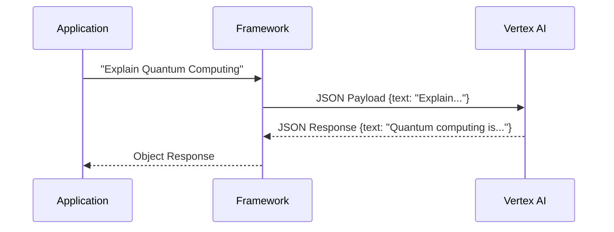
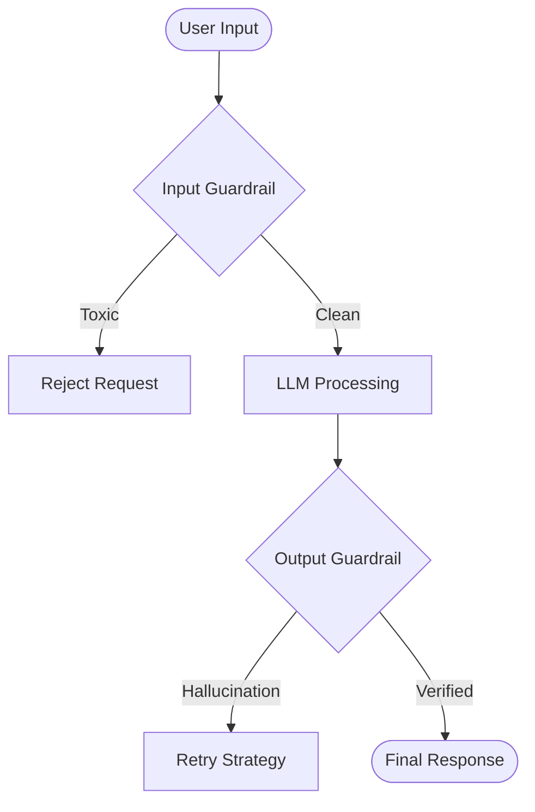
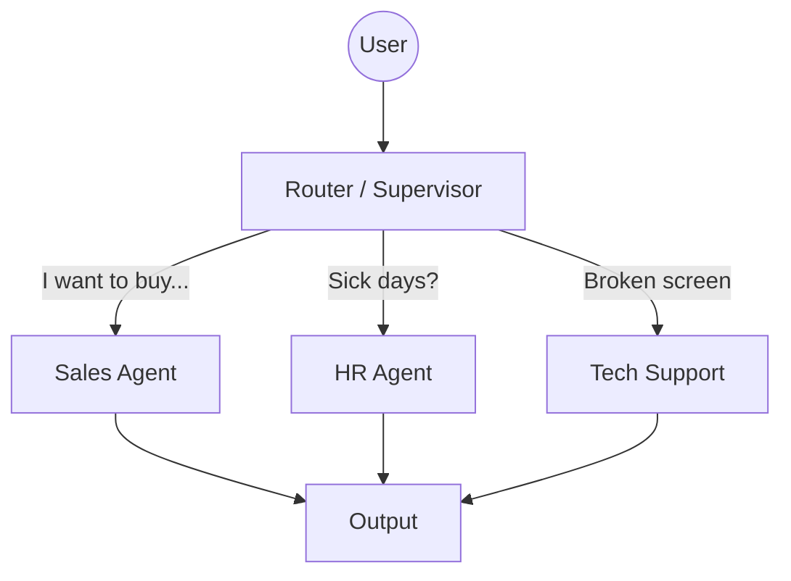
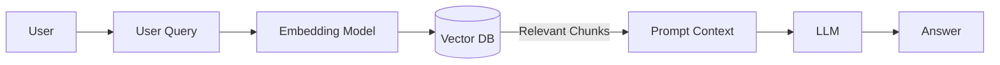
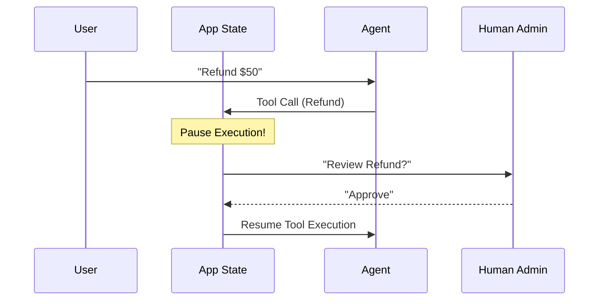
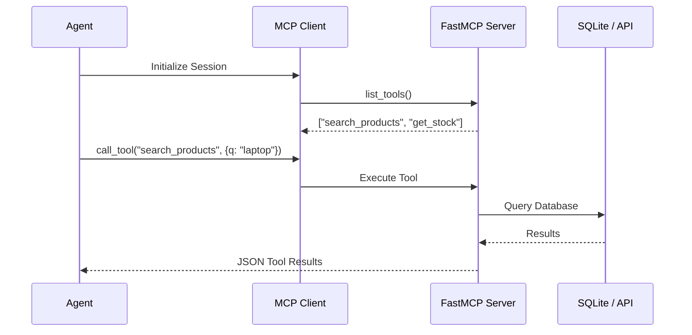

# Agentic AI & LLM Learning Track: Concept Mastery Guide 🧠

Welcome to the master reference guide for our 13-Level Agentic AI Learning Track! This comprehensive document explains the core concepts taught in each level. It compares the architectural approaches and syntax of **Google ADK** (a minimal, function-calling framework) against **LangChain & LangGraph** (a massive ecosystem for stateful LLM orchestration).

---

## 🚀 The 13-Level Journey Overview

| Level  | Concept                   | ADK Implementation             | LangChain / LangGraph                |
| :----- | :------------------------ | :----------------------------- | :----------------------------------- |
| **01** | **Single Agent Basics**   | `Agent(model="gemini")`        | `ChatGoogleGenerativeAI`             |
| **02** | **Prompt Engineering**    | `instruction=""`               | `ChatPromptTemplate`                 |
| **03** | **Custom Tools**          | Python array `[func_name]`     | `@tool` & `bind_tools()`             |
| **04** | **Guardrails & Safety**   | Callback validation            | LCEL `RunnableLambda`                |
| **05** | **Monitoring/Callbacks**  | Native `after_model_callback`  | `BaseCallbackHandler`                |
| **06** | **Multi-Agent Routing**   | Hierarchical `sub_agents`      | Supervisor `StateGraph`              |
| **07** | **Workflows (Pipelines)** | `SequentialAgent`              | Parallel Node `StateGraph`           |
| **08** | **State & Memory**        | Stateful memory lists          | `MemorySaver` Checkpointer           |
| **09** | **RAG / Grounding**       | Google Search Tool integration | `InMemoryVectorStore`                |
| **10** | **Production Patterns**   | Full combined agent            | `create_react_agent`                 |
| **11** | **MCP Integration**       | FastMCP Tool Discovery         | `MCPToolkit` & `StdioServer`         |
| **12** | **Streaming & HITL**      | Generators & `input()` hooks   | `interrupt_before=["tools"]`         |
| **13** | **Time Travel (Forking)** | _Not natively supported_       | `get_state_history` & `update_state` |
| **14** | **MCP (LangChain)**       | _(Shared with Level 11)_       | `MCPToolkit` Integration             |

---

## Level 01: Single Agent Basics

**The Goal:** Connect to the LLM backend (Gemini via Vertex AI), send a text payload, and receive a response.



### Google ADK

The ADK abstracts the API payload into a simple `Agent` class wrapper. It hides message formatting behind an easy interface.

```python
from google.adk.agents import Agent
agent = Agent(name="basic", model="gemini-2.5-flash")
response = agent.run("Hello there!")
print(response)
```

### LangChain

LangChain abstracts the model into a standard `Runnable` interface using `invoke()`.

```python
from langchain_google_genai import ChatGoogleGenerativeAI
llm = ChatGoogleGenerativeAI(model="gemini-2.5-flash")
response = llm.invoke("Hello there!")
print(response.content)
```

---

## Level 02: Prompt Engineering

**The Goal:** Define the "persona" and boundaries of the agent using specific prompt types. Modern LLMs distinguish between different types of messages to structure reasoning and context correctly:

1. **System / Developer Prompt:** The invisible, high-priority instructions that dictate the core behavior, tone, and logical constraints of the agent (e.g., "You are a helpful assistant. Never reveal secure information").
2. **User / Human Prompt:** The actual query typed by the end-user (e.g., "What is the capital of France?").
3. **AI / Assistant Prompt:** The historical replies generated by the model, re-injected into the context window so the LLM remembers what it just said.

### Google ADK

You define the System/Developer prompt directly on the agent object using the `instruction` key. The ADK abstracts message history away, so you generally only pass the instruction string and the user's input.

```python
agent = Agent(
    model="gemini-2.5-flash",
    instruction="You are a funny pirate. Always respond like one." # System/Developer Prompt
)

agent.run("Tell me a joke!") # Automatically formatted as a User Prompt
```

### LangChain

LangChain utilizes explicit message classes (`SystemMessage`, `HumanMessage`, `AIMessage`) to construct the context window. It uses `ChatPromptTemplate` to structure these independently from the user's input, stringing them together via LCEL (LangChain Expression Language) pipelines.

```python
from langchain_core.prompts import ChatPromptTemplate

prompt = ChatPromptTemplate.from_messages([
    ("system", "You are a funny pirate. Always respond like one."), # Fixed System Message
    ("human", "{user_input}")                                       # Dynamic User Message
])

chain = prompt | llm
chain.invoke({"user_input": "Hello!"})
```

---

## Level 03: Custom Tools (Function Calling)

**The Goal:** Give the LLM eyes and hands to interact with external APIs (like weather databases, ticketing systems, calculators).

```mermaid
sequenceDiagram
    participant User
    participant Loop as Framework / SDK
    participant LLM as Gemini
    participant Tool as Python Function

    User->>Loop: "Weather in NY?"
    Loop->>LLM: Input + Shared Tool Schemas
    LLM-->>Loop: Tool Call Request (get_weather, "NY")
    Note over Loop: Stops generation to run code
    Loop->>Tool: Execute get_weather("NY")
    Tool-->>Loop: Results: "Sunny"
    Loop->>LLM: Return Tool Results
    LLM-->>User: "It's sunny in NY."
```

### Google ADK

The ADK has a native infinite loop. If an LLM requests a tool, the ADK automatically executes the Python function and feeds the result back without you writing the loop logic.

```python
def weather(city: str) -> str:
    """Returns the current weather for a given city."""
    return "Sunny"

agent = Agent(model="gemini-2.5-flash", tools=[weather])
# Auto-executes the python function seamlessly
agent.run("What's the weather in NY?")
```

### LangChain

In base LangChain, tools must explicitly use the `@tool` decorator, must be bound to the LLM, and you must use LangGraph (or write a manual `while` loop) to handle the back-and-forth execution.

```python
from langchain_core.tools import tool

@tool
def weather(city: str) -> str:
    """Returns the current weather for a given city."""
    return "Sunny"

llm_with_tools = llm.bind_tools([weather])
# Returns a tool call object! Does NOT automatically loop.
```

---

## Level 04: Guardrails & Safety

**The Goal:** Validate inputs/outputs so that an Agent does not perform dangerous actions or say inappropriate things.



### Google ADK

ADK can utilize callback hooks (`before_tool_callback` or `before_model_callback`) or wrap functions with standard Python validation.

```python
def check_pii(text: str):
    if "SSN" in text:
        raise ValueError("Cannot process Personally Identifiable Information.")
```

### LangChain

LangChain utilizes LCEL `RunnableLambda` chains to pipe information through validation functions before it reaches the model, or Pydantic `OutputParsers` to ensure the structure is strictly typed.

```python
from langchain_core.runnables import RunnableLambda

def input_guardrail(text: dict):
    if "hack" in text["input"]:
        raise ValueError("Malicious intent detected!")
    return text

safe_chain = RunnableLambda(input_guardrail) | prompt | llm
```

---

## Level 05: Monitoring & Callbacks

**The Goal:** Gain visibility into the "black box" of LLM execution by triggering events when a tool fires or an LLM finishes a generation chunk.

### Google ADK

ADK provides explicit hook properties directly on the Agent definition.

```python
def log_generation(response, **kwargs):
    print(f"Tokens Used: {response.usage.total_tokens}")

agent = Agent(
    model="gemini-2.5-flash",
    after_model_callback=log_generation
)
```

### LangChain

LangChain heavily utilizes the `BaseCallbackHandler` class, which fires across a massive variety of lifecycle events (nodes, tools, LLMs, retries, errors).

```python
from langchain_core.callbacks import BaseCallbackHandler

class MyLogger(BaseCallbackHandler):
    def on_llm_end(self, response, **kwargs):
        print("Generation finished.")

chain.invoke({"user_input": "Hi"}, config={"callbacks": [MyLogger()]})
```

---

## Level 06: Multi-Agent Routing

**The Goal:** Break down a massive prompt into specialized workers (e.g. Sales bot vs HR bot vs Tech Support bot).



### Google ADK (Hierarchical Trees)

The ADK supports native tree-based routing using `sub_agents`. A root agent intelligently routes questions to its leaf specific agents.

```python
sales_agent = Agent(name="sales_bot", instruction="Sell things.")
hr_agent = Agent(name="hr_bot", instruction="Manage PTO.")

# The root agent decides which sub-agent is best suited for the query
router = Agent(name="main_router", sub_agents=[sales_agent, hr_agent])
```

### LangGraph (Stateful DAG)

LangGraph treats agents as nodes in a mathematical graph. A Supervisor node decides the next edge to traverse.

```python
from langgraph.graph import StateGraph

builder = StateGraph(State)
builder.add_node("sales", sales_node)
builder.add_node("hr", hr_node)
builder.add_conditional_edges("supervisor", router_logic) # Logic determines routing
```

---

## Level 07: Workflows & Pipelines

**The Goal:** Enforce a strict chronological pipeline. Ensure Step 1 completes entirely before Step 2 begins (e.g., Research -> Draft -> Edit -> Publish).

```mermaid
journey
    title Document Processing Pipeline
    section Stage 1: Extraction
      OCR Tool: 5: Agent
    section Stage 2: Synthesis
      Summarize: 3: Agent
    section Stage 3: Output
      Format JSON: 4: Agent
```

### Google ADK

ADK utilizes a dedicated `SequentialAgent` class designed to run agents chronologically in a linked chain.

```python
from google.adk.agents import SequentialAgent
pipeline = SequentialAgent(
    agents=[research_agent, write_agent, review_agent]
)
```

### LangGraph

LangGraph strings graph nodes together with direct, chronological edges and no conditionals.

```python
builder.add_edge("researcher", "writer")
builder.add_edge("writer", "reviewer")
builder.add_edge("reviewer", END)
```

---

## Level 08: State & Memory

**The Goal:** Maintain conversation history across isolated REST API calls. Because serverless environments (like Cloud Run) spin up and down, memory must be stored somewhere.

| Feature        | Session Memory (ADK)       | Persistent Checkpointers (LangGraph) |
| :------------- | :------------------------- | :----------------------------------- |
| **Philosophy** | RAM (Python Object arrays) | External Database (SQLite/Postgres)  |
| **Resilience** | Lost on Server Restart     | Survives crashes and deployments     |

### Google ADK

History is maintained in runtime arrays managed by `InMemorySessionService`. (See `main.py`).

```python
from google.adk.sessions import InMemorySessionService
service = InMemorySessionService()
session = await service.create_session(app_name="app", user_id="1", session_id="abc")
# Passes session object to the runner to append history
```

### LangGraph

LangGraph uses rigorous database "Checkpointers" to save the exact mathematical state of the graph after _every single node transition_.

```python
from langgraph.checkpoint.memory import MemorySaver
memory = MemorySaver()
app = create_react_agent(model=llm, checkpointer=memory)
app.invoke({"messages": [HumanMessage("Hello")]}, config={"configurable": {"thread_id": "1"}})
```

---

## Level 09: Retrieval-Augmented Generation (RAG)

**The Goal:** Give the LLM access to private, proprietary information via vector databases.



### Google ADK

RAG is typically integrated via a Tool that queries Vertex AI Search or an explicit connection to Google Cloud's native Search Tools.

```python
def query_knowledge_base(query: str):
    # Perform vector search logic here
    return document_text

agent = Agent(tools=[query_knowledge_base])
```

### LangChain

LangChain possesses an enormous ecosystem of Vector Stores (`InMemoryVectorStore`, Pinecone, Qdrant). It provides built-in `retrievers` that chunk, format, and push context directly into prompts.

```python
from langchain_core.vectorstores import InMemoryVectorStore
store = InMemoryVectorStore.from_texts(["Secret recipe is salt."], embedding_model)
retriever = store.as_retriever()
```

---

## Level 10: Production Patterns

**The Goal:** Combine memory, tools, and prompts into a full, production-ready "React" (Reason + Act) loop.

### LangGraph (React Agent)

Instead of building the graph entirely manually, LangGraph provides the `create_react_agent` helper pattern, which combines routing, tools, and state out of the box.

```python
from langgraph.prebuilt import create_react_agent
production_app = create_react_agent(llm, tools=[t1, t2], checkpointer=memory)
```

---

## Level 11: Observability (LangSmith)

**The Goal:** Monitor inputs, outputs, token costs, latency, and tool paths for thousands of user interactions in a production UI.

### LangChain

LangChain natively forces all tracing data to the LangSmith cloud UI simply by setting environment variables. No code changes are required!

```env
LANGCHAIN_TRACING_V2=true
LANGCHAIN_API_KEY=lsv2_...
LANGCHAIN_PROJECT=production_app
```

---

## Level 12: Streaming & HITL (Human-in-the-Loop)

**The Goal:**

1. Stream tokens back to a UI instantly to lower perceived latency.
2. Pause an AI agent right before it executes a high-stakes action (like a refund or sending an email) to get administrator approval.



### Google ADK

ADK can use Python `generators` to stream tokens. For Human-in-the-Loop, ADK utilizes the `before_tool_callback` hook where you can pause the thread entirely (using `input()` for tests).

```python
def human_approval(tool, args, ctx):
    ans = input(f"Approve {tool.name}? (y/n)")
    if ans == 'n': return {"error": "Denied by human."}

agent = Agent(tools=[refund], before_tool_callback=human_approval)
```

### LangGraph

LangGraph utilizes `interrupt_before=["tools"]`. Because it uses a database checkpointer, the application safely halts and drops out of memory. It waits for a secondary REST `.invoke()` call from an administrator's UI frontend to resume the graph where it left off.

```python
app = builder.compile(checkpointer=memory, interrupt_before=["tools"])
# Run 1 processes. execution halts before the tool node.
# Run 2 resumes execution.
```

---

## Level 13: Time Travel (State Forking)

**The Goal:** Look at a past conversation, pick a historical node execution, alter a historical message, and test how it changes the future ("forking" the timeline).

### LangGraph

Because LangGraph saves the exact serialized state after every node step in SQLite/Postgres, you can fetch the checkpoint ID, update the state database, and effectively rewrite history.

```python
history = app.get_state_history(thread_config)
# Pick checkpoint 3 from the past and alter the DB state!
app.update_state(checkpoint_3_config, {"messages": [altered_message]})
app.invoke(None, config=checkpoint_3_config) # Runs altered timeline
```

_Note: The lightweight Google ADK does not natively support complex time travel, focusing instead on straight-line execution for low latency._

---

## Level 14: Model Context Protocol (MCP)

**The Goal:** Standardize how agents connect to external tool servers. Instead of hardcoding tools into the agent, the agent "connects" to an MCP server and dynamically discovers what it can do.



### Google ADK (Level 11)

ADK uses a custom bridge to talk to the MCP server via `stdio`. This demonstrates how lightweight frameworks can adopt global standards.

```python
async def call_mcp_tool(tool_name, arguments):
    # stdio_client launches 'uv run mcp_server.py'
    async with stdio_client(server_params) as (read, write):
        async with ClientSession(read, write) as session:
            return await session.call_tool(tool_name, arguments)
```

### LangChain (Level 14)

LangChain provides a native `MCPToolkit` that automatically converts MCP server tool definitions into LangChain `BaseTool` objects.

```python
from langchain_mcp import MCPToolkit
toolkit = await MCPToolkit.from_stdio(server_params)
agent = create_react_agent(llm, toolkit.get_tools())
```

---

_For more extensive, executable code examples, review the respective source files in the `adk_labs/` and `langchain_labs/` directories._
